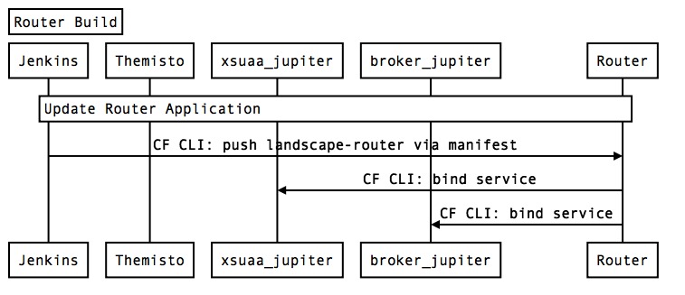
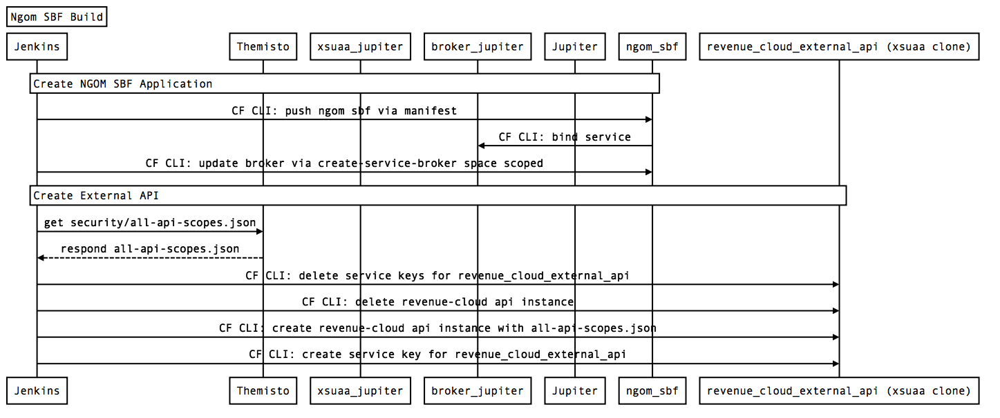
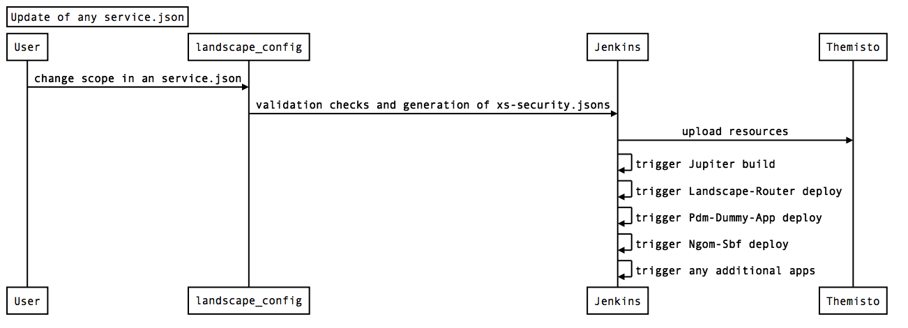
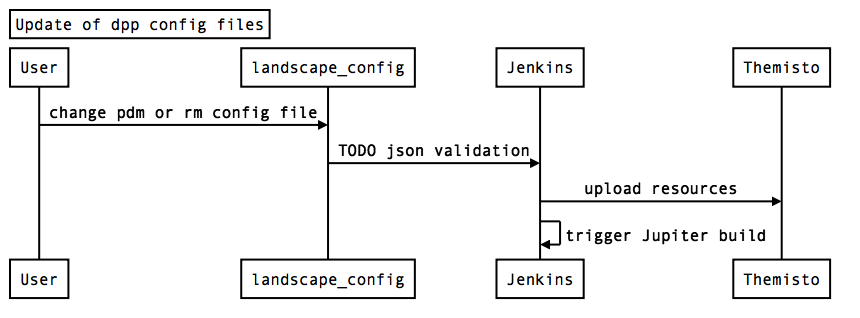
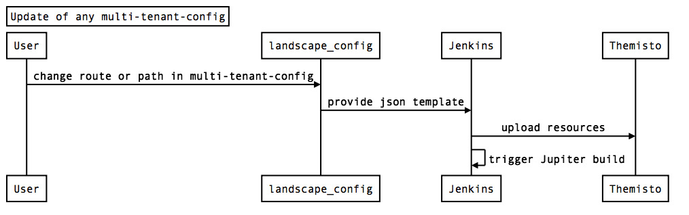

# Build Sequences for Infrastructure Services:  
- [RevenueCloud SaaSApplication (Jupiter) Initial](#RevenueCloudSaaSApplicationInitialBuild)   
- [RevenueCloud SaaSApplication (Jupiter)](#RevenueCloudSaaSApplicationBuild)  
- [Landscape Router](#RouterBuild)   
- [Ngom Service Broker Framework (SBF)](#NgomSbfBuild)   
- [Update Services json and xssecurity.json](#UpdateServiceJson)   
- [Update Dpp Config (PDM/Personal Data Manager)](#UpdateDppConfig)   
- [Update MultiTenant Configuration](#UpdateMultiTenantConfig)   

<a name="RevenueCloudSaaSApplicationInitialBuild"/>

## RevenueCloud SaaSApplication (Jupiter) Initial  

<a name="RevenueCloudSaaSApplicationBuild"/>

## RevenueCloud SaaSApplication (Jupiter)  

<a name="RouterBuild"/>

## Landscape Router  

<a name="NgomSbfBuild"/>

## Ngom Service Broker Framework (SBF)  

<a name="UpdateServiceJson"/>

## Update Services json and xssecurity.json  

<a name="UpdateDppConfig"/>

## Update Dpp Config (PDM/Personal Data Manager  

<a name="UpdateMultiTenantConfig"/>

## Update MultiTenant Configuration  

								
		
	
